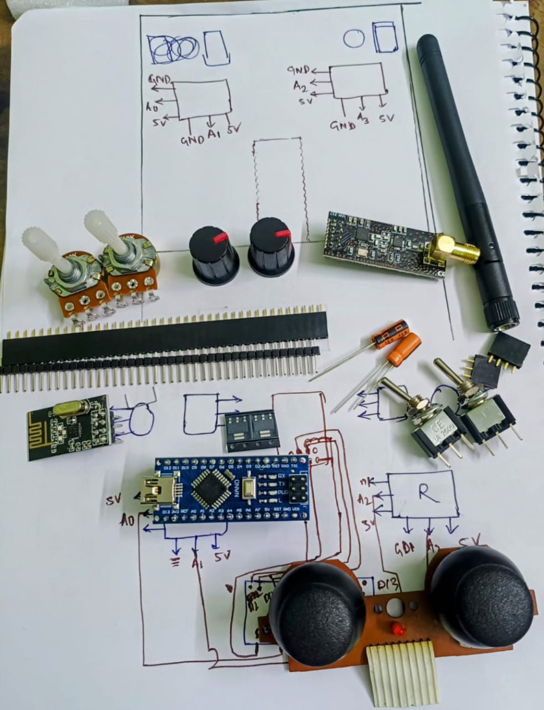
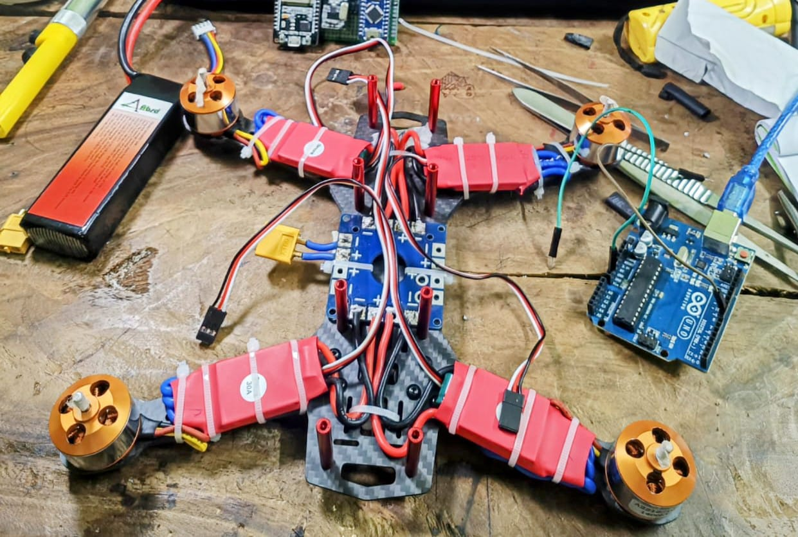
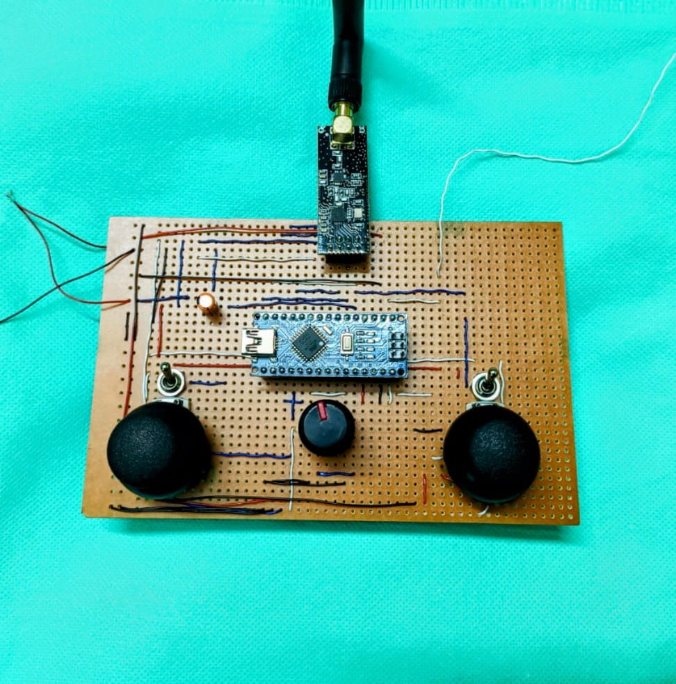
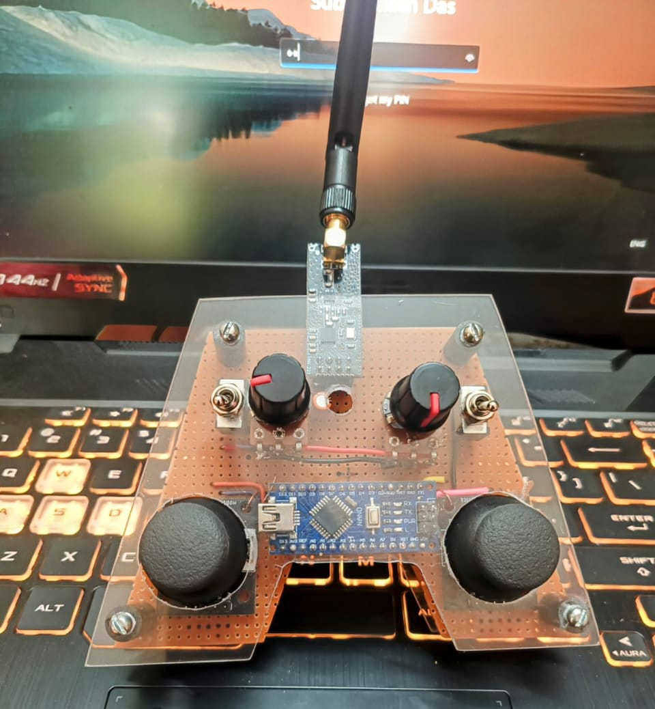
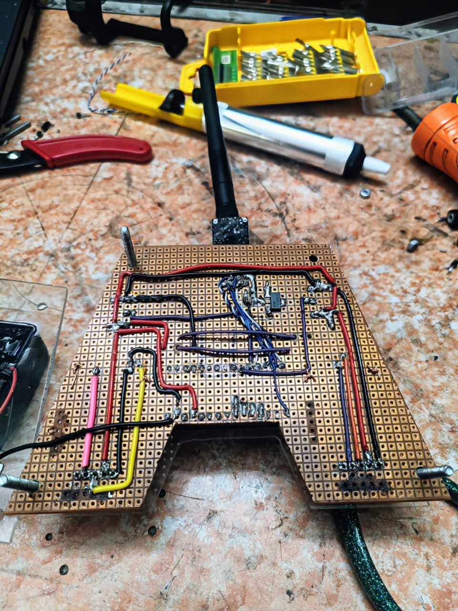
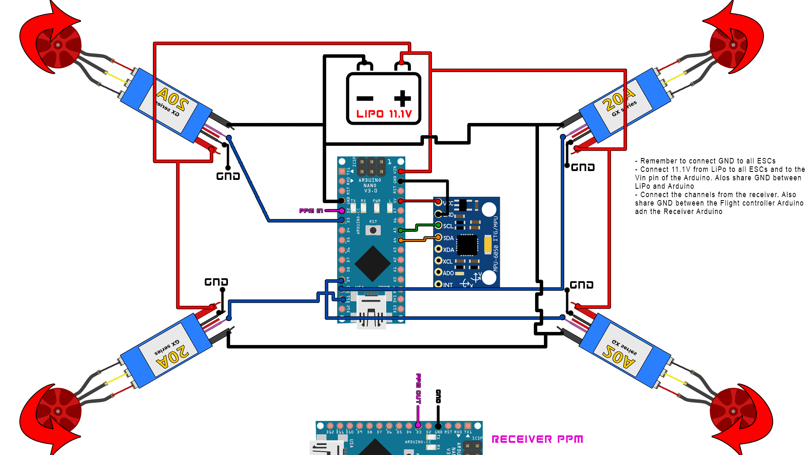

# Quadcopter-From-Scratch
A 100% self-built quadcopter drone powered by Arduino and NRF24L01 wireless modules, featuring a hand-crafted RC controller and flight controller. The project is based on Electronoobs tutorials, and includes complete wiring, code, and documentation. All aspects—from transmitter hardware to drone firmware—were developed independently, including soldering, radio communication setup, and PID-based stabilization using an MPU6050.
🛠️ Ideal for electronics students, Arduino hobbyists, and anyone exploring UAVs or embedded systems.

# 🛸 DIY Arduino Drone with Custom RC Controller

A fully functional quadcopter drone built from scratch using Arduino Nano, NRF24L01 wireless modules, and custom-built transmitter. This was a solo project developed over two years of self-learning, heavily inspired by [Electronoobs Drone Series](http://electronoobs.com/eng_robotica_tut5_1.php).

## 📷 Project Preview
### Final component lists

### Drone Body

### RC transmitter_first prototype

### RC final_transmitter font picture

### RC final_transmitter  back picture

### Watch the successful flight Video
[Watch the successful flight Video2](https://lnkd.in/dVTs-ih5)

---

## 🚁 Features

- Custom-made **RC transmitter** using:
  - Arduino Nano
  - NRF24L01
  - 2x joystick modules
  - Rotary knobs for trim/throttle
- **Receiver and Flight Controller**:
  - Arduino Nano
  - NRF24L01
  - MPU6050 (gyro + accelerometer)
  - ESCs + Brushless motors
- Power: 3S LiPo battery
- Frame: Carbon fiber arms + 3D printed/mounted center

---

## 🛠️ Components

| Part | Description |
|------|-------------|
| Arduino Nano (x2) | One for transmitter, one on drone |
| NRF24L01 | Wireless data link |
| MPU6050 | IMU sensor |
| Joystick Modules | For pitch, roll, yaw, throttle |
| ESCs + Brushless motors | For flight |
| 3S LiPo Battery | Power source |
| Perfboard & Jumpers | Manual wiring |

---

## 📐 Wiring & Schematics

---

## 💾 Code

- `transmitter.ino`: Arduino code for RC controller
- Includes calibration, NRF communication, sensor filtering

---

## 📚 References & Credits

- [Electronoobs Drone Tutorial](http://electronoobs.com/eng_robotica_tut5_1.php)
- [Transmitter Build](http://electronoobs.com/eng_robotica_tut5_2.php)
- [Flight Controller Logic](http://electronoobs.com/eng_robotica_tut5_3.php)

---

## 🔖 License

This project is shared for educational purposes. Feel free to fork and improve!

---

## 🙌 Creator

Built with curiosity and persistence by **[Subhabilash Das]**  
Inspired by a dream after watching *3 Idiots* — turned into a real working drone.

